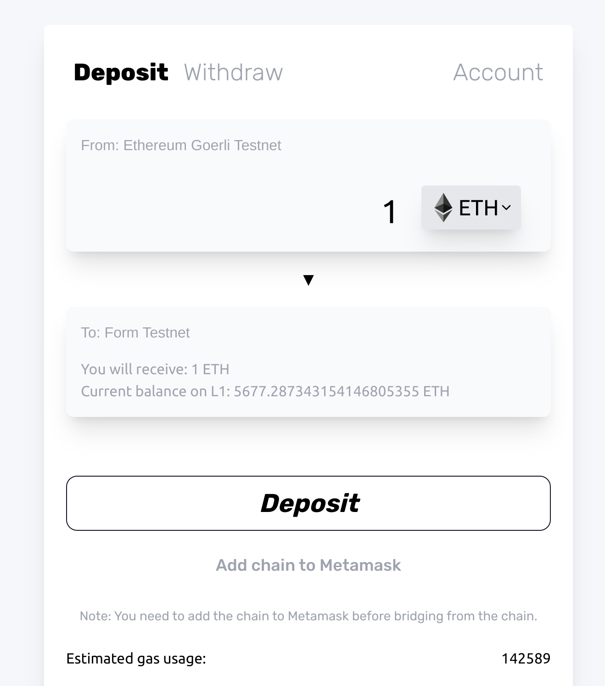
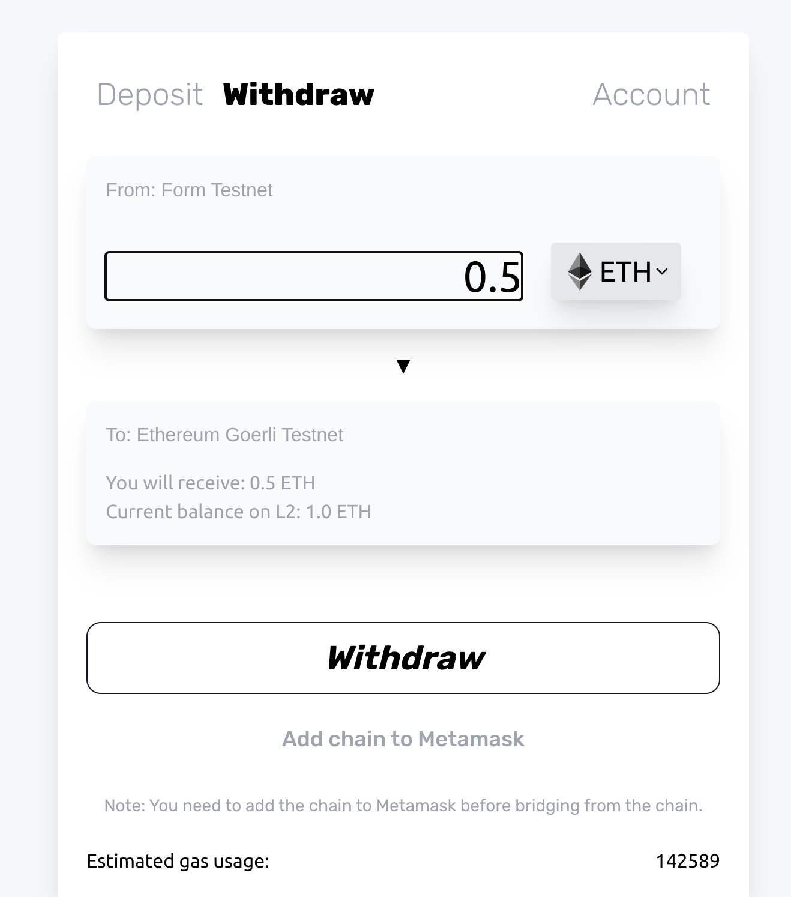
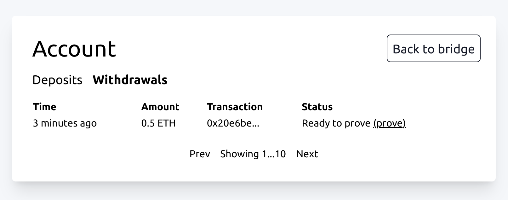

# Bridge to Form Testnet

## Depositing to Form
Navigate to [the form bridge](https://bridge.form.network/). Ensure you have a positive balance of testnet ETH on the Goerli network.

Enter the desired amount to deposit, connect your browser wallet (eg. Metamask) to the bridge app, and press the button to deposit funds.

## Withdrawing from Form

As with similar optimistic rollups like Optimism and Arbitrum, withdrawals from the native Form bridge requires two steps.

### Initiate the withdrawal on the L2

Navigate to the "withdrawal" tab of the main UI, and enter in the amount of goerli ETH to withdraw. Then, press the "withdraw" button and confirm the withdrawal transaction in Metamask

### Finalize the withdrawal on the L1

After the withdrawal delay period (~10 minutes on testnet), the withdrawal can be finalized on the L1. Navigate to the "account" tab and click on "withdrawals". Then, switch Metamask's network to Goerli, and click on "prove" to complete the withdrawal finalization process.

