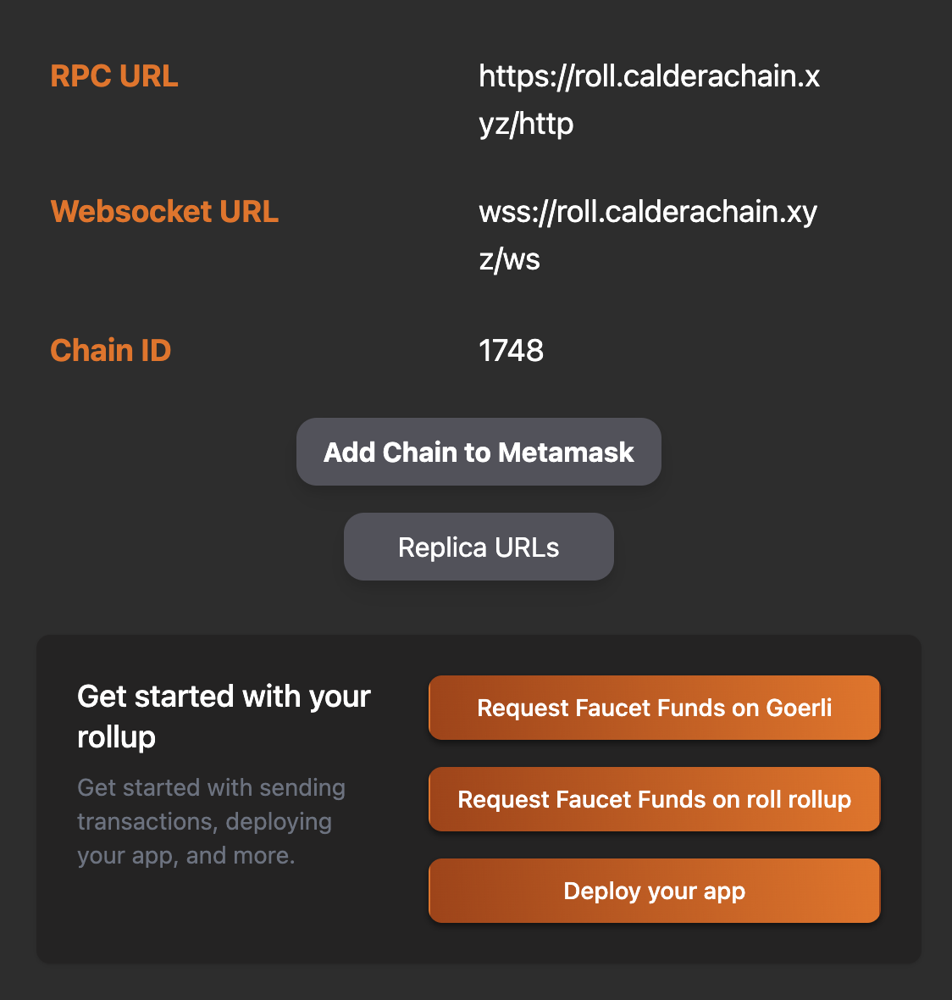

# Add Roll to Metamask
## Using the Roll Chain Hub Page
Navigate to https://roll.demo.caldera.dev/, and press the 
**Add to Metamask** button on the *Rollup Details* section of the homepage.

## Manually via Metamask
You can also add the network manually via the following details:
- Network Name: Roll
- RPC URL: https://roll.calderachain.xyz/http
- Chain ID: 1748
- Currency Symvol: ETH
