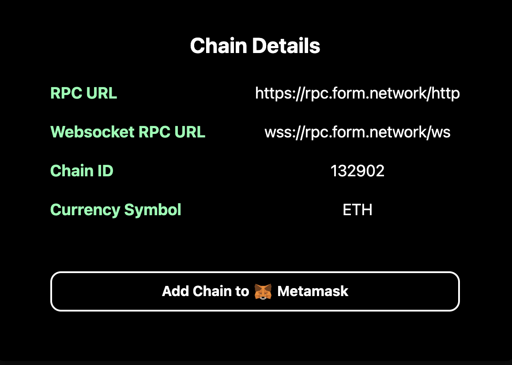

# Add Form Testnet to Metamask
## Using the Form Hub Page
1. Navigate to our [Hub Page](https://form.caldera.dev/)
2. Click the 
**Add to Metamask** button in the *Rollup Details* section

## Manually via Metamask
You can add the network manually via the following details:
- Network Name: Form Testnet
- RPC URL: https://form.calderachain.xyz/http
- Chain ID: 1748
- Currency Symbol: ETH