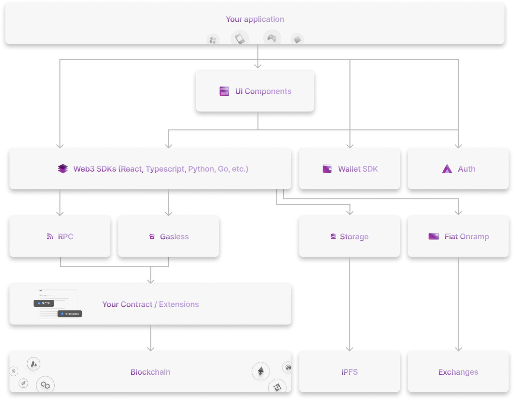

# What is Thirdweb?

[Thirdweb](https://thirdweb.com/) is a comprehensive development framework that empowers developers to seamlessly build, launch,
and manage web3 applications and games across any EVM-compatible blockchain, including Form Testnet.

## Architecture

Thirdweb's tool suite spans the entire developer workflow, offering solutions at the smart contract, application and infrastructure layers.

## Getting Started

To learn more about how to get started with Thirdweb, take a look at their [docs](https://portal.thirdweb.com/), which provide in-depth
guides for their [Wallet SDK](https://portal.thirdweb.com/wallet), [User Authentication](https://portal.thirdweb.com/auth), [Solidity Smart Contract SDK](https://portal.thirdweb.com/solidity), [Paper Checkout Tool](https://docs.withpaper.com/reference/checkouts-overview]), and more!